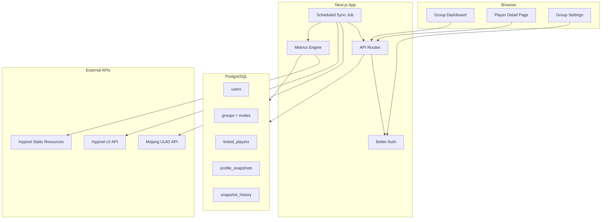

# Skyblock Progress Tracker — Build Plan

## Goal

A private website where you and friends can:
- Create/join a **group** via invite link
- Link **Minecraft usernames** and pick which Skyblock profile to track (main coop, ironman, etc.)
- See **group leaderboard** and per-player **maxing progress** across all major categories
- Track **progress over time** (weight, networth, skill average, etc.)

This project has been completed. All features from the build plan have been implemented.

---

## Recommended Stack

| Layer | Choice | Why |
|-------|--------|-----|
| Framework | **Next.js 15 (App Router) + TypeScript** | Full-stack, API routes, cron, easy deploy |
| UI | **Tailwind CSS + shadcn/ui** | Fast, polished dashboards and tables |
| Database | **PostgreSQL** (Neon or Supabase free tier) | Relational data for users, groups, snapshots |
| ORM | **Drizzle** | Lightweight, good TS types |
| Auth | **Better Auth** (email/password + optional Discord OAuth) | Self-hosted, fits private friend groups |
| Hypixel client | **[@skyblock-ts/core](https://www.npmjs.com/package/@skyblock-ts/core)** | Typed v2 Skyblock API wrapper |
| Networth | **[skyhelper-networth](https://www.npmjs.com/package/skyhelper-networth)** | Same approach as SkyCrypt |
| Weight | **Senither formulas** (server-side module) | Industry-standard progress score |
| Background sync | **Vercel Cron** or **Inngest** | Refresh profiles on a schedule |
| Deploy | **Vercel** + **Neon** | Free tier, minimal ops |

---

## Architecture



**Key design choice:** Never call Hypixel on every page load. A scheduled job fetches profiles, computes metrics, stores snapshots, and the UI reads from Postgres. Manual "Refresh now" is allowed but rate-limited (e.g. once per 15 min per player).

---

## Data Model (core tables)

- **users** — auth identity (email, name)
- **groups** — name, owner, invite code (short random token)
- **group_members** — user ↔ group, role (`owner` | `member`)
- **linked_players** — Minecraft IGN, UUID, selected `profile_id`, `game_mode`, linked to a user + group
- **profile_snapshots** — latest computed metrics per linked player (JSON + indexed columns for sorting)
- **snapshot_history** — daily (or per-sync) rollups for charts
- **sync_jobs** — status, errors, last run (optional but useful for debugging)

Indexed snapshot columns for leaderboard sorting: `senither_weight`, `skill_average`, `catacombs_level`, `networth`, `overall_completion_pct`.

---

## Hypixel Integration

### Prerequisites (you do once)
1. Create a Hypixel application at [developer.hypixel.net](https://developer.hypixel.net) and get an **API key**
2. Store in `.env` as `HYPIXEL_API_KEY` (never commit)
3. Each friend must have **API settings enabled in-game** (Settings → API) or profile data will be incomplete

### Fetch pipeline (per linked player)
1. Resolve IGN → UUID via Mojang API (cache UUID indefinitely)
2. `GET /v2/skyblock/profiles?uuid=...` — all profiles
3. Pick tracked profile (user-selected, or default: highest Senither weight / last played)
4. Additional calls for that profile:
   - `GET /v2/skyblock/museum?profile=...` (networth)
   - `GET /v2/skyblock/garden?profile=...` (garden level, copper)
5. Cache static resources once at startup / daily:
   - `/v2/resources/skyblock/collections` — max tiers per collection
   - `/v2/resources/skyblock/skills` — XP thresholds

### Rate limits
Personal keys are ~**120 requests / 5 minutes**. For a friend group of ~10 players, syncing every 30–60 minutes is safe. Always read `RateLimit-Remaining` headers and back off on 429.

---

## Metrics Engine ("Maxing" Definitions)

Build a single server module ([`lib/metrics/`](lib/metrics/)) that turns raw profile JSON into normalized progress objects.

### v1 categories and "max" targets

| Category | Source data | Max target |
|----------|-------------|------------|
| **Skills** | `player_data.experience_skill_*` | Level 60 each (+ track excess XP toward 60) |
| **Slayer** | `slayer_bosses` XP | Tier 9 for Revenant, Tarantula, Sven, Enderman, Blaze |
| **Dungeons** | `dungeons.dungeon_types.catacombs` + `player_classes` | Catacombs 50, each class 50 |
| **Collections** | `collection` counts vs static resource tiers | Max tier per collection item |
| **Weight** | Computed Senither | Sum of skill + slayer + dungeon weight (display + rank by) |
| **Networth** | `skyhelper-networth` on profile + museum + bank | Display total + non-cosmetic; optional % toward personal goal |
| **Minions** | `crafted_generators` + profile minion slots | Unique minions crafted / known max set |
| **Pets** | `pets` array | Pet score (level × rarity weight) or unique legendary+ count |
| **Bestiary** | `bestiary` kills + milestones | Milestone completion % per family |
| **SkyBlock Level** | `leveling` / `levelingExperience` | Level 440+ (adjust as game updates) |

Each category returns:
```ts
{ current, max, percent, breakdown: [...], missing: [...] }
```

**Overall completion %** = weighted average of category percents (skills/slayer/dungeons weighted higher than cosmetic-adjacent categories).

Reference existing trackers for UX inspiration (not to copy): [SkyCrypt](https://sky.shiiyu.moe), [SkyTools collections](https://www.skytools.app/collections).

---

## App Pages and Features

### Auth & onboarding
- `/login`, `/register`
- After login: create group **or** join via `/join/[inviteCode]`
- Onboarding: link Minecraft IGN → pick profile from list → confirm

### Group dashboard (`/group/[id]`)
- Summary cards: group avg weight, total networth, avg skill average
- Sortable table: all friends with key stats + overall % bar
- Category filter tabs (Skills, Slayer, Dungeons, etc.)
- "Last synced" timestamp + manual refresh button

### Player detail (`/group/[id]/player/[linkedPlayerId]`)
- Header: IGN, profile name, game mode badge, SkyBlock level
- Progress rings/bars per category
- Expandable breakdowns (e.g. per-skill, per-slayer, per-collection tier gaps)
- 30-day trend charts (weight, networth, SA) from `snapshot_history`
- Link out to SkyCrypt for deep inventory view

### Group settings (`/group/[id]/settings`) — owner only
- Regenerate invite link
- Remove members
- Set group display name

---

## Project Structure

```
Skyblock-Tracker/
├── app/
│   ├── (auth)/login, register
│   ├── (app)/group/[id]/page.tsx
│   ├── (app)/group/[id]/player/[playerId]/page.tsx
│   ├── api/auth/[...]
│   ├── api/sync/route.ts          # cron-triggered
│   └── api/players/[id]/refresh/route.ts
├── components/
│   ├── dashboard/                 # LeaderboardTable, ProgressBar, StatCard
│   └── player/                    # SkillGrid, SlayerPanel, CollectionGrid
├── lib/
│   ├── hypixel/client.ts          # @skyblock-ts/core wrapper
│   ├── metrics/                   # skills, slayer, dungeons, collections, weight, pets, bestiary
│   ├── networth/calculate.ts
│   └── sync/syncPlayer.ts
├── db/schema.ts                   # Drizzle schema
└── .env.example
```

---

## Implementation Phases

### Phase 1 — Foundation (get something working)
- Scaffold Next.js + Tailwind + shadcn + Drizzle + Better Auth
- DB schema + migrations
- Group create/join with invite codes
- Link Minecraft username + profile picker
- Basic Hypixel fetch + store raw snapshot
- Dashboard showing skills, slayer, catacombs, skill average

### Phase 2 — Maxing engine
- Static resources cache (collections/skills thresholds)
- Full metrics engine: collections %, Senither weight, overall completion %
- Player detail page with category breakdowns
- Scheduled sync job (every 30–60 min)

### Phase 3 — Comprehensive metrics
- Networth via skyhelper-networth (+ museum fetch)
- Minions, pets, bestiary, garden metrics
- Snapshot history + trend charts
- Manual refresh with cooldown + sync error UI

### Phase 4 — Polish
- Dark theme (Skyblock aesthetic)
- Empty/error states (API disabled, invalid IGN, rate limited)
- README with setup steps and `.env.example`
- Optional: Discord OAuth for easier friend login

---

## Important Constraints and Edge Cases

- **Co-op profiles:** One profile may have multiple members — track the linked user's member slice, but show coop profile name and mode
- **Profile selection:** Let users explicitly choose; default to highest-weight profile
- **Ironman / Stranded / Bingo:** Show game mode badge; optionally separate leaderboards later
- **API privacy:** If a player disables API, show a clear "data hidden" state instead of partial/wrong data
- **Game updates:** Max tiers and weight formulas change — keep thresholds in config files, not hardcoded magic numbers scattered in UI
- **Hypixel ToS:** Use one server-side API key; do not expose it to the browser; implement caching as required by [Hypixel API policies](https://api.hypixel.net/)

---

## Environment Variables

```env
DATABASE_URL=
BETTER_AUTH_SECRET=
BETTER_AUTH_URL=http://localhost:3000
HYPIXEL_API_KEY=
CRON_SECRET=              # protects /api/sync from public abuse
```

---

## Success Criteria for v1

- You can invite a friend, they log in, link their IGN, and appear on the group dashboard within one sync cycle
- Dashboard ranks friends by weight, skill average, and overall maxing %
- Player page shows comprehensive breakdown across all 9 categories
- Data refreshes automatically without hitting rate limits
- Site is deployable to Vercel with minimal configuration

---

## Project Status: ✅ COMPLETED

All phases have been successfully implemented:

- ✅ **Phase 1:** Basic auth, groups, Hypixel fetch, dashboard with core stats
- ✅ **Phase 2:** Full metrics engine, static resources, scheduled sync, player details
- ✅ **Phase 3:** Networth integration, minions/pets/bestiary, history charts, manual refresh
- ✅ **Phase 4:** Dark theme, error states, README, deployment configuration

The application is fully functional and ready for deployment to Vercel + Neon.
